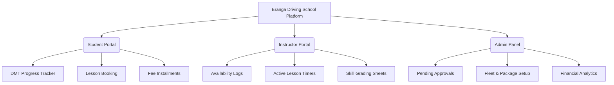

# SOFTWARE REQUIREMENTS SPECIFICATION (SRS)
## Eranga Driving School Management Platform

---

**SRI LANKA INSTITUTE OF ADVANCED TECHNOLOGICAL EDUCATION**  
**Higher National Diploma in Information Technology**  

**HNDIT 4052: Programming Individual Project**  

**PROJECT TITLE:** Eranga Driving School Management Platform  
**ACADEMIC YEAR:** 2324  
**YEAR:** II, **SEMESTER:** II  

**SUBMITTED BY:** M.F Abdul Ahadh  
**REGISTRATION NO:** KUR/IT/2324/F/0083  

**SUPERVISOR:** Ms. K.G.D.De.A Wijesinghe  

---

## Table of Contents
1. [INTRODUCTION](#1-introduction)
   - 1.1 Purpose of this Document
   - 1.2 Scope of the System
   - 1.3 Definitions and Acronyms
   - 1.4 System Overview
2. [GENERAL DESCRIPTION](#2-general-description)
   - 2.1 Product Perspective
   - 2.2 Product Functions
   - 2.3 User Classes and Characteristics
   - 2.4 Features and Benefits
   - 2.5 Assumptions and Dependencies
3. [FUNCTIONAL REQUIREMENTS](#3-functional-requirements)
   - 3.1 User Authentication & Profile
   - 3.2 DMT/RMV Learner Workflow Progress Tracking
   - 3.3 Training Lesson Scheduling & Booking
   - 3.4 Package & Fee Management
   - 3.5 Payment Tracking & Invoice Records
   - 3.6 Vehicle & Maintenance Fleets
   - 3.7 Instructor Availability & Active Session Logs
   - 3.8 Admin Controls & Security Verification
   - 3.9 Reports & Business Analytics
4. [INTERFACE REQUIREMENTS](#4-interface-requirements)
   - 4.1 User Interface
   - 4.2 Software Interface
   - 4.3 Communication Interface
5. [DESIGN CONSTRAINTS](#5-design-constraints)
6. [NON-FUNCTIONAL REQUIREMENTS](#6-non-functional-requirements)
   - 6.1 Performance
   - 6.2 Security
   - 6.3 Reliability
   - 6.4 Usability
   - 6.5 Scalability
   - 6.6 Maintainability
7. [APPENDICES](#7-appendices)
   - 7.1 Assumptions
   - 7.2 Dependencies
   - 7.3 Acronyms
   - 7.4 References
8. [SYSTEM DIAGRAMS](#8-system-diagrams)
   - 8.1 Use Case Diagram Overview
   - 8.2 Entity Relationship Diagram (ERD) Structure
   - 8.3 Class Diagram Overview

---

## 1. INTRODUCTION

### 1.1 Purpose of this Document
This Software Requirements Specification (SRS) document provides a comprehensive, structured description of the **Eranga Driving School Management Platform**. The primary objective is to define the functional and non-functional specifications of the platform, outlining its features, user roles, operational workflows, and constraints. 

This document serves as the official blueprint and formal agreement between the student developer (M.F Abdul Ahadh), the project supervisor (Ms. K.G.D.De.A Wijesinghe), and the academic evaluation committee of the Sri Lanka Institute of Advanced Technological Education (SLIATE). It guides the entire Software Development Life Cycle (SDLC) from design and coding to verification, testing, and deployment.

### 1.2 Scope of the System
The **Eranga Driving School Management Platform** is a web-based, state-of-the-art enterprise solution engineered to replace traditional, manual, paper-based workflows in driving schools in Sri Lanka. It digitizes scheduling, vehicle tracking, payment histories, and student status logs. 

Crucially, the system coordinates with the **Sri Lankan Department of Motor Traffic (DMT / RMV)** 7-step learner workflow, guiding students sequentially through:
1. **Medical Certificate Submission**: Securing fitness forms from registered medical officers.
2. **DMT Application Processing**: Submitting Form A, NIC duplicates, and support materials.
3. **Theory Examination Preparation**: Taking district MCQ exams.
4. **Learner's Permit Issuance**: Managing the active 3-month validation card.
5. **Practical Training Hours**: Recording hours and skill modules with certified instructors.
6. **Practical DMT Road Test**: Taking evaluations on closed circuits.
7. **Final Driving License Dispatch**: Disbursing the official printed license.

The platform provides dedicated, custom dashboards for three primary user classes: **Students**, **Instructors**, and **Administrators**.

### 1.3 Definitions and Acronyms

| Acronym | Meaning |
| :--- | :--- |
| **SRS** | Software Requirements Specification |
| **SLIATE** | Sri Lanka Institute of Advanced Technological Education |
| **HNDIT** | Higher National Diploma in Information Technology |
| **DMT** | Department of Motor Traffic (Sri Lanka) |
| **RMV** | Registrar of Motor Vehicles (Sri Lanka) |
| **NIC** | National Identity Card (Sri Lanka) |
| **UI / UX** | User Interface / User Experience |
| **CRUD** | Create, Read, Update, Delete |
| **ERD** | Entity Relationship Diagram |
| **HMR** | Hot Module Replacement |
| **NoSQL** | Non-Relational Structured Query Language database |

### 1.4 System Overview
The **Eranga Driving School Management Platform** acts as a centralized operational hub that eliminates manual record books, spreadsheets, and chaotic phone-based schedules. It integrates secure Firebase authentication with Firestore NoSQL database systems. 

Through the student portal, learners can sign up, select structured packages (e.g., Light Vehicle Auto/Manual, Heavy Vehicles), schedule practice slots, verify their progression through DMT benchmarks, and record payment balances. 

Instructors manage their schedules, log student competencies in real-time, and run active training sessions equipped with countdown timers and skill checklists. 

Administrators retain global control: approving user sign-ups, assigning vehicles and instructors to sessions, updating package pricing, auditing incoming payments, and rendering graphical business reports.

---

## 2. GENERAL DESCRIPTION

### 2.1 Product Perspective
The system is constructed as a modern, single-page web application (SPA) using React.js and Vite. It connects directly with Google Firebase cloud architecture for database operations, user sessions, and hosting. 

The software operates as a standalone business management suite tailored specifically to the logistical and legal landscape of Sri Lankan driving schools. It coordinates dynamic datasets across three specific roles:



### 2.2 Product Functions
The primary features of the platform include:
1. **User Authentication & Role Mapping**: Securing user accounts via Firebase and mapping them dynamically to Admin, Instructor, or Student roles.
2. **DMT Progress Tracking**: An interactive, 7-step tracker visually logging the student's legal journey with the RMV.
3. **Session Scheduling and Booking**: Enabling students to request specific training slots, instructors, and vehicles without double-booking.
4. **Active Instructor Interface**: Tools for instructors to run live sessions with integrated timers and custom driving-skill logs.
5. **Installment Payment Management**: Securely logging, tracking, and simulating invoice transactions, along with automated notifications for outstanding balances.
6. **Fleet and Packages Inventory**: Global administration of school vehicles, pricing models, and service classes.
7. **Business Analytics Dashboard**: Data visualization charts showing monthly revenue, monthly class counts, and student pass ratios.

### 2.3 User Classes and Characteristics

#### 2.3.1 Student (Customer)
* **Description**: Individuals who enroll in courses to obtain a Sri Lankan driving license.
* **Technical Competence**: Minimal. Requires an easy-to-use, intuitive layout compatible with mobile devices.
* **Actions**: Register accounts, submit personal applications (NIC, DOB, gender, address), choose packages, request lessons, log payments, track DMT milestones, and review administrative alerts.

#### 2.3.2 Instructor
* **Description**: Certified training staff who deliver physical driving instruction.
* **Technical Competence**: Basic. Accesses the system primarily via smartphones while in training vehicles.
* **Actions**: Set available schedule hours, review assigned student progress sheets, run live driving sessions, log skill completion logs, and record lesson completions.

#### 2.3.3 Administrator
* **Description**: Office managers who control operations, schedule assignments, and manage finances.
* **Technical Competence**: Moderate. Accesses the system on desktop computers.
* **Actions**: Manage registrations, update packages, allocate vehicles and instructors, log cash payments, track schedules, view system audits, and generate financial reports.

### 2.4 Features and Benefits
* **Structured Progress Tracker**: Aligns driving lessons with Sri Lanka's DMT guidelines, giving students transparency on what steps remain.
* **Automated Conflict Resolution**: Prevents double-booking of vehicles and instructors.
* **Live Lesson Verification**: Ensures instructors log accurate lesson durations and evaluate specific driving competencies (e.g., clutch control, parking).
* **Payment Installment Control**: Facilitates structured payment tracking, preventing enrollment progression for students with extreme unpaid balances.
* **Visual Enterprise Analytics**: Empowers business owners to audit fleet health, revenue trends, and operational capacity.

### 2.5 Assumptions and Dependencies
* **Internet Connectivity**: Users must have active internet connections to synchronize real-time updates through Firebase Firestore.
* **Firebase Operational Uptime**: The application relies entirely on Google Firebase services.
* **Browser Compatibility**: Users are assumed to use modern web browsers (Chrome, Firefox, Edge, Safari) that support HTML5, CSS3, ES6 features, and local storage mechanisms.
* **DMT Guidelines**: It is assumed that the 7-step RMV framework remains the legal standard for acquiring driving licenses in Sri Lanka.

---

## 3. FUNCTIONAL REQUIREMENTS

### 3.1 User Authentication & Profile
* **REQ-3.1.1**: The system shall support secure sign-up, sign-in, and sign-out capabilities via Firebase Authentication.
* **REQ-3.1.2**: New registrations shall default to a `pending` approval status. They must be audited and approved by an administrator before accessing role-restricted features.
* **REQ-3.1.3**: The system shall provide secure role-based access controls, routing users automatically to `/admin`, `/instructor`, or `/student` depending on their credentials.
* **REQ-3.1.4**: Students shall be able to submit and modify their profiles, including legal name, NIC number, Date of Birth, gender, mailing address, and phone number.

### 3.2 DMT/RMV Learner Workflow Progress Tracking
* **REQ-3.2.1**: The system shall support a dynamic 7-step tracker reflecting the student's DMT status (Medical Certificate -> DMT Application -> Theory Exam -> Learner's Permit -> Practical Training -> Practical Test -> License Issued).
* **REQ-3.2.2**: The student's current step shall update in real-time on the student dashboard as administrators or instructors verify their progress.
* **REQ-3.2.3**: The system shall restrict certain activities based on progress. For example, students cannot book practical lessons if their step status indicates they have not yet received their Learner's Permit.

### 3.3 Training Lesson Scheduling & Booking
* **REQ-3.3.1**: Students shall be able to submit booking requests, choosing their preferred date, time slot, instructor, and vehicle.
* **REQ-3.3.2**: The system shall automatically cross-reference availability to prevent conflict scheduling for the selected instructor and vehicle.
* **REQ-3.3.3**: Bookings shall support transitions across multiple states: `Pending`, `Approved`, `Cancelled`, and `Completed`.
* **REQ-3.3.4**: Instructors shall be able to view their daily and weekly schedules on their personalized calendar interface.

### 3.4 Package & Fee Management
* **REQ-3.4.1**: Administrators shall be able to create, read, update, and delete training packages (e.g., Gold Package - Light Manual + Auto, Platinum Package - Heavy Commercial).
* **REQ-3.4.2**: Each package must have a designated fee, vehicle class, and total included training hours.
* **REQ-3.4.3**: Students shall be able to browse available packages and enroll in a course.

### 3.5 Payment Tracking & Invoice Records
* **REQ-3.5.1**: The system shall track total fees, completed installments, and outstanding balances for each enrolled student.
* **REQ-3.5.2**: The system shall provide an online payment simulation interface (Sandbox environment) allowing students to pay in installments.
* **REQ-3.5.3**: Administrators shall be able to manually enter offline cash payments and generate digital invoice records.
* **REQ-3.5.4**: The system shall block booking actions if outstanding fees exceed custom limits.

### 3.6 Vehicle & Maintenance Fleets
* **REQ-3.6.1**: Administrators shall be able to manage the school's fleet of training vehicles (adding registration plate number, fuel type, transmission type, and maintenance status).
* **REQ-3.6.2**: Vehicle status states shall include: `Active`, `Under Service`, and `Inactive`.
* **REQ-3.6.3**: Vehicles marked as `Under Service` or `Inactive` shall be blocked from booking selections.

### 3.7 Instructor Availability & Active Session Logs
* **REQ-3.7.1**: Instructors shall be able to set their weekly availability slots, which are pulled during student booking requests.
* **REQ-3.7.2**: The system shall support a live "Active Session" view for instructors once a lesson starts.
* **REQ-3.7.3**: The Active Session view shall feature a live countdown timer tracking elapsed training hours.
* **REQ-3.7.4**: Instructors shall be able to record progress against specific training competencies (e.g., parallel parking, clutch control, reversing, traffic driving) during an active session.

### 3.8 Admin Controls & Security Verification
* **REQ-3.8.1**: Administrators shall have a dedicated audit panel to manage all user registrations, review profiles, and change statuses from `Pending` to `Approved`.
* **REQ-3.8.2**: The system shall restrict access to Firestore databases by utilizing specific Firestore Security Rules based on roles.
* **REQ-3.8.3**: Administrators shall be able to reassign students to different instructors or update session bookings manually in case of emergencies.

### 3.9 Reports & Business Analytics
* **REQ-3.9.1**: The system shall generate graphical business reports on the Admin Dashboard using Recharts data models.
* **REQ-3.9.2**: Reports shall include monthly revenue timelines, monthly lesson tallies, and student pass/fail statistics.
* **REQ-3.9.3**: The admin dashboard shall display quick KPI counters (e.g., Total Income, Active Students, Pending Registrations, Fleet Availability).

---

## 4. INTERFACE REQUIREMENTS

### 4.1 User Interface
The **Eranga Driving School Management Platform** features a premium, professional corporate aesthetic with subtle glassmorphism to reflect precision and modern logistics. 

#### 4.1.1 Color Tokens

| Token | HSL / Hex Code | Usage |
| :--- | :--- | :--- |
| `primary` | `#0B2545` | Main headers, key actions, brand labels |
| `secondary` | `#8DA9C4` | Highlights, auxiliary navigation borders |
| `success` | `#16a34a` | Progress badges, payment clearances |
| `background` | `#F1F4F9` | Subtle soft body gradients |
| `surface` | `#ffffff` | Primary content cards |
| `surface-dim` | `#f0f3ff` | Low-contrast section dividers |

#### 4.1.2 Typography
* **Headings**: Hanken Grotesk is used to create sharp, modern headings.
* **Body Text**: Inter is used for body copy and data tables to ensure legibility.

#### 4.1.3 Layout Rules
* The desktop application is optimized for standard desktop resolutions, centered within a `1440px` grid container.
* Modals and dropdowns utilize glassmorphism styling, styled with `rgba(255, 255, 255, 0.85)` backgrounds and `12px` backdrop blur filters.
* Layouts are responsive. On mobile displays, complex tables stack vertically into card views for easy mobile navigation.

### 4.2 Software Interface

| Component | Technology | Version | Purpose |
| :--- | :--- | :--- | :--- |
| **Frontend Framework** | React.js | `^18.x` | Controls component state and single-page routing |
| **Build Suite** | Vite | `^5.x` | Bundles resources, manages fast HMR |
| **Styling Core** | Tailwind CSS | `^3.x` | Applies utility styles |
| **Database** | Firebase Firestore | Cloud | Stores collections of users, bookings, payments, and fleets |
| **Auth Provider** | Firebase Auth | Cloud | Manages secure sign-up sessions and passwords |
| **Reporting Charts** | Recharts | `^2.x` | Generates SVG-based dashboard charts |

### 4.3 Communication Interface
* **HTTPS**: Secure communication (SSL/TLS) is enforced for all data transmissions between clients and Firebase hosting endpoints.
* **JSON**: Data payloads sent to and from Firebase Firestore services are structured as native JSON objects.
* **Real-time Event Listeners**: The system implements real-time Firestore listeners (`onSnapshot`) to push notifications, booking confirmations, and progress status updates to users without page reloads.

---

## 5. DESIGN CONSTRAINTS
* **Web-Only Architecture**: The initial application is built as a responsive web application and does not include native iOS/Android builds.
* **Firebase Services Limit**: Real-time read/write volume constraints depend on standard Firebase plan limits.
* **NoSQL Database Structure**: Because the system uses Firestore (a NoSQL database), queries must follow Firestore indexing rules.
* **Security Constraints**: Critical operations, such as financial logs, must bypass local storage and operate solely through authenticated backend Firestore database rules.

---

## 6. NON-FUNCTIONAL REQUIREMENTS

### 6.1 Performance
* **Response Time**: Interactive dashboard elements (like updating DMT step trackers or checking availability) shall respond in under 2 seconds.
* **Initial Page Load**: The system's initial bundle load time shall remain under 3 seconds over standard 4G connections.
* **Real-time Synchronization**: Firestore data updates shall reflect on dashboards within 1.5 seconds.

### 6.2 Security
* **Data Encryption**: All user passwords shall remain encrypted and secure through Firebase Authentication.
* **Role Enforcement**: User actions (e.g., modifying vehicle inventories or approving student sign-ups) must be validated using Firestore Security Rules to prevent spoofing.
* **Input Validation**: All forms (like booking forms, profiles, and vehicle registrations) shall sanitize inputs to prevent injection attacks.

### 6.3 Reliability
* **Data Integrity**: Database transactions shall verify that double-bookings do not occur, maintaining data consistency even during concurrent booking attempts.
* **Automated Cloud Backups**: Relying on Google Firebase infrastructure guarantees automated cloud backups and high system availability (99.9% uptime).

### 6.4 Usability
* **Intuitive Interfaces**: Separate dashboards are designed to ensure users can access key actions (like scheduling, grading, or reporting) in under three clicks.
* **Contextual Feedback**: The system displays informative toast alerts to confirm successful actions or explain errors clearly.
* **Mobile Friendliness**: Driving instructors and students can easily manage classes and schedules on mobile devices.

### 6.5 Scalability
* **Expandable Fleet and Packages**: Administrators can easily scale operations by adding more vehicles, instructors, and custom packages without code updates.
* **API Standardization**: Data payloads use standard JSON schemas, allowing future integrations with external services (like SMS gateways or DMV portals).

### 6.6 Maintainability
* **Modular Components**: The codebase is split into clean, reusable React components (`/components`, `/pages`, `/context`).
* **Detailed Styling**: Page layouts are paired with documented CSS classes (`instructor.css`, `AdminDashboard.css`), separating layout concerns from business logic.

---

## 7. APPENDICES

### 7.1 Assumptions
* Users have active internet access via cellular data or Wi-Fi.
* Administrators review and update pending student approvals and payment receipts on time.
* Firebase infrastructure remains operational without major global outages.

### 7.2 Dependencies
* **React.js and Vite Runtime**: Required to run the client-side SPA.
* **Google Firebase Console**: Retains database indexes, users, and security settings.
* **Google Fonts API**: Provides custom fonts (Inter, Hanken Grotesk) to render typography correctly.

### 7.3 Acronyms
* **SLIATE**: Sri Lanka Institute of Advanced Technological Education
* **HNDIT**: Higher National Diploma in Information Technology
* **DMT / RMV**: Department of Motor Traffic / Registrar of Motor Vehicles (Sri Lanka)
* **NIC**: National Identity Card
* **SPA**: Single Page Application
* **KPI**: Key Performance Indicator

### 7.4 References
* **IEEE Std 830-1998**: IEEE Recommended Practice for Software Requirements Specifications.
* **React Documentation**: https://react.dev
* **Firebase Security Rules Documentation**: https://firebase.google.com/docs/rules
* **Sommerville, I. (2016)**: *Software Engineering*, 10th Edition.
* **Tailwind CSS Styling Reference**: https://tailwindcss.com

---

## 8. SYSTEM DIAGRAMS

### 8.1 Use Case Diagram Overview

```
                          +-------------------------------------------------+
                          |             ERANGA DRIVING SCHOOL               |
                          |                                                 |
                          |                 +--------------------+          |
                          |                 |   Sign Up/Login    |          |
                          |                 +---------+----------+          |
                          |                           ^                     |
                          |                           |                     |
     +------------+       |                 +---------+----------+          |
     |            |-------+---------------->| Enroll Training Pkg|<---------+--------+------------+
     |  STUDENT   |       |                 +--------------------+          |        |            |
     |  (Learner) |-------+---------------->| View Progress Steps|          |        |   ADMIN    |
     |            |       |                 +--------------------+          |        | (Manager)  |
     +------------+       |                 +--------------------+          |        |            |
                          |                 | Book Driving Slot  |<---------+--------+------------+
                          |                 +--------------------+          |        |            |
                          |                 +--------------------+          |        |            |
                          |                 | Manage Student Logs|<---------+--------+------------+
     +------------+       |                 +--------------------+          |        |            |
     |            |-------+---------------->| Start Live Session |          |        |            |
     | INSTRUCTOR |       |                 +--------------------+          |        |            |
     |            |-------+---------------->| Grade Skill Checklist         |        |            |
     +------------+       |                 +--------------------+          |        |            |
                          |                 | Fleet & Rates Setup|<------------------+            |
                          |                 +--------------------+          |                     |
                          |                 | Financial Audits   |<------------------+            |
                          |                 +--------------------+          |                     |
                          +-------------------------------------------------+
```

### 8.2 Entity Relationship Diagram (ERD) Structure

The NoSQL data modeling for Google Firestore utilizes the following document associations:

```
+---------------------+           +---------------------+           +---------------------+
|    COLLECTION:      |           |    COLLECTION:      |           |    COLLECTION:      |
|       users         |           |      bookings       |           |      payments       |
+---------------------+           +---------------------+           +---------------------+
| * uid (PK)          |1         N| * bookingId (PK)    |1         N| * paymentId (PK)    |
| - name              |-----------| - studentId (FK)    |-----------| - studentId (FK)    |
| - email             |           | - instructorId (FK) |           | - amount            |
| - role (Student/    |           | - vehicleId (FK)    |           | - date              |
|   Instructor/Admin) |           | - date              |           | - type (Card/Cash)  |
| - status (Pending/  |           | - timeSlot          |           | - status            |
|   Approved)         |           | - status (Pending/  |           +---------------------+
| - progress (0-100)  |           |   Approved/Done)    |
| - currentStep       |           +---------------------+
+---------------------+
           |1
           |
           |N
+---------------------+
|    COLLECTION:      |
|      vehicles       |
+---------------------+
| * vehicleId (PK)    |
| - plateNumber       |
| - transmission      |
| - status (Active/   |
|   Maintenance)      |
+---------------------+
```

### 8.3 Class Diagram Overview
The frontend React architecture is structured around components, utility hooks, and context providers:

```
                      +----------------------------+
                      |        AuthContext         |
                      |  - currentUser: Object     |
                      |  - userProfile: Object     |
                      +--------------+-------------+
                                     |
                                     | (Provides Auth & Profiles)
                                     v
         +---------------------------+---------------------------+
         |                           |                           |
         v                           v                           v
+------------------+        +------------------+        +------------------+
| StudentDashboard |        |InstructorDashbd  |        |  AdminDashboard  |
| - enrolledPkg    |        | - schedule       |        | - pendingUsers   |
| - dmtStepList    |        | - activeTimer    |        | - incomeReports  |
+------------------+        +------------------+        +------------------+
         |                           |                           |
         | (Sub-pages)               | (Sub-pages)               | (Sub-pages)
         v                           v                           v
- ViewPackages              - Availability              - AllStudents
- BookingPage               - ActiveSession             - Vehicles
- PaymentHistory            - MarkComplete              - Bookings
- ProgressTracker           - SessionDetails            - Payments
```
